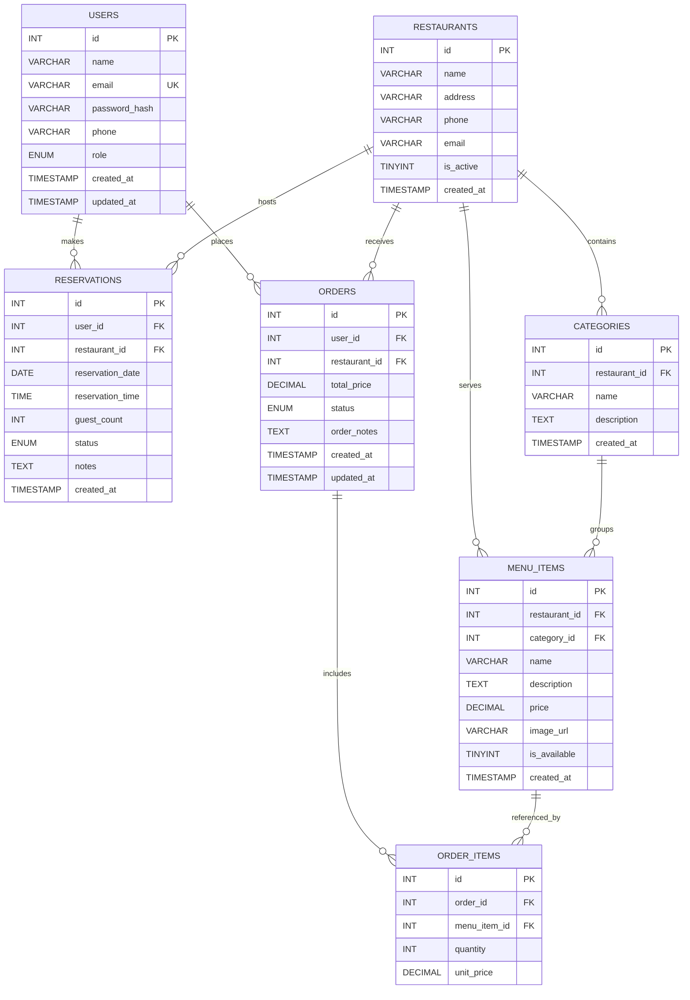

# SmartDine ER Diagram

```mermaid
erDiagram
    USERS ||--o{ RESERVATIONS : makes
    USERS ||--o{ ORDERS : places

    RESTAURANTS ||--o{ CATEGORIES : contains
    RESTAURANTS ||--o{ MENU_ITEMS : serves
    RESTAURANTS ||--o{ RESERVATIONS : hosts
    RESTAURANTS ||--o{ ORDERS : receives

    CATEGORIES ||--o{ MENU_ITEMS : groups

    ORDERS ||--o{ ORDER_ITEMS : includes
    MENU_ITEMS ||--o{ ORDER_ITEMS : referenced_by

    USERS {
        INT id PK
        VARCHAR name
        VARCHAR email UK
        VARCHAR password_hash
        VARCHAR phone
        ENUM role
        TIMESTAMP created_at
        TIMESTAMP updated_at
    }

    RESTAURANTS {
        INT id PK
        VARCHAR name
        VARCHAR address
        VARCHAR phone
        VARCHAR email
        TINYINT is_active
        TIMESTAMP created_at
    }

    CATEGORIES {
        INT id PK
        INT restaurant_id FK
        VARCHAR name
        TEXT description
        TIMESTAMP created_at
    }

    MENU_ITEMS {
        INT id PK
        INT restaurant_id FK
        INT category_id FK
        VARCHAR name
        TEXT description
        DECIMAL price
        VARCHAR image_url
        TINYINT is_available
        TIMESTAMP created_at
    }

    RESERVATIONS {
        INT id PK
        INT user_id FK
        INT restaurant_id FK
        DATE reservation_date
        TIME reservation_time
        INT guest_count
        ENUM status
        TEXT notes
        TIMESTAMP created_at
    }

    ORDERS {
        INT id PK
        INT user_id FK
        INT restaurant_id FK
        DECIMAL total_price
        ENUM status
        TEXT order_notes
        TIMESTAMP created_at
        TIMESTAMP updated_at
    }

    ORDER_ITEMS {
        INT id PK
        INT order_id FK
        INT menu_item_id FK
        INT quantity
        DECIMAL unit_price
    }
```